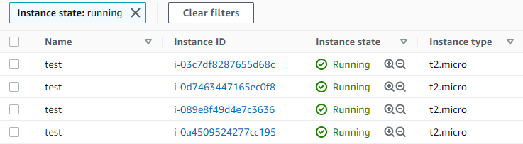
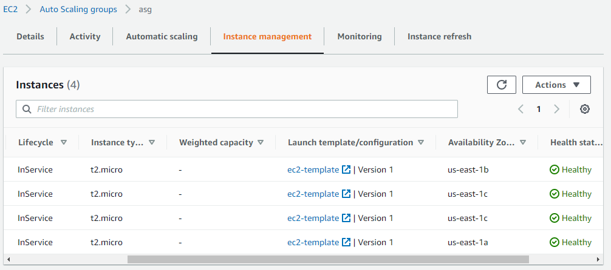
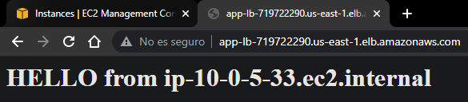
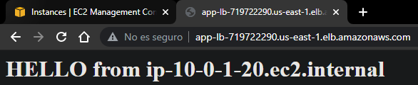
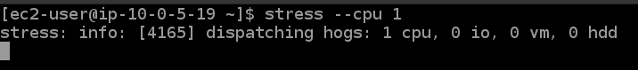
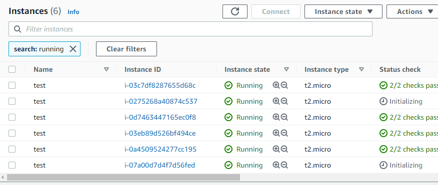
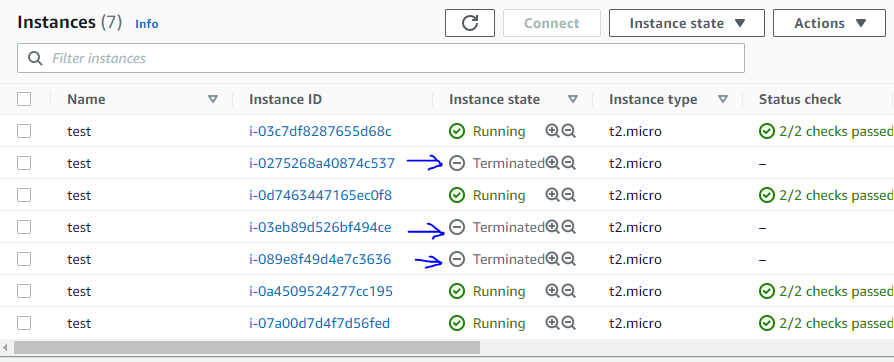

# Terraform AWS Auto Scaling with ALB

## Descripcion

- La Arquitectura consiste en un auto scaling group con un ALB para balanceo de carga
- Para el Auto scaling group se toman en cuenta 3 subnets publicas distribuidas en zonas de disponibilidad diferentes
- Cuando se coloque la direccion DNS del ALB en un navegador se podra observar si la carga se esta distribuyendo entre las instancias, mediante la impresion del hostname en la pagina web de la siguiente forma
- Para testear que nuestro auto scaling group funciona se realizan pruebas de estres de CPU ingresando a las instancias que se crean de acuerdo a la cantidad deseada que se especifican en los archivos de configuracion de terraform, y asi ver si se provisionan y disminuyen la cantidad de Instancias EC2 de acuerdo a la demanda.

## Arquitectura

La Arquitectura esta diseñada e implementada en 3 AZs y consta de los siguientes recursos:

- 1 Internet Gateway
- 3 Subnets publicas
- 1 Auto Scaling Group
- 1 Application Load Balancer


## Uso
- Para crear la infraestrutura debemos ejecutar los siguientes comandos:
```t
terraform init
terraform validate 
terraform plan
terraform apply -auto-approve
```

# Archivos

## Provider

```t
terraform {
  required_providers {
    aws = {
      source  = "hashicorp/aws"
      version = "~>3.49"
    }
  }
}
provider "aws" {
  profile = "default"
  region  = "us-east-1"
}
```

## 01 - Vars Vpc

```t
variable "cidr" {
  type = string
  default = "10.0.0.0/16"
}

variable "azs" {
  type = list(string)
  default = [   "us-east-1a", 
                "us-east-1b", 
                "us-east-1c"    ]
}

variable "subnets-ips" {
  type = list(string)
  default = [   "10.0.1.0/24",
                "10.0.3.0/24",
                "10.0.5.0/24"  ]
}
```
## 02 - Vpc

```t
resource "aws_vpc" "vpc" {
  cidr_block = var.cidr

  tags = {
    Name = "custom-vpc"
  }
}
```

## 03 - Subnets

```t
resource "aws_subnet" "pub-subnets" {
  count             = "${length(var.azs)}"
  vpc_id            = aws_vpc.vpc.id
  cidr_block        = "${element(var.subnets-ips, count.index)}"
  availability_zone = "${element(var.azs, count.index)}"
  map_public_ip_on_launch = true

  tags = {
    Name = "subnets-${element(var.azs, count.index)}"
  }
}
```

## 04 - Security Groups

```t
resource "aws_security_group" "sg1" {
  name        = "allow-ssh"
  description = "Port 22"
  vpc_id      = aws_vpc.vpc.id

  ingress {
    description = "Allow Port 22"
    from_port   = 22
    to_port     = 22
    protocol    = "tcp"
    cidr_blocks = ["0.0.0.0/0"]
  }

  egress {
    description = "Allow all ip and ports outboun"
    from_port   = 0
    to_port     = 0
    protocol    = "-1"
    cidr_blocks = ["0.0.0.0/0"]
  }
}

resource "aws_security_group" "sg2" {
  name        = "allow-web"
  description = "Port 80"
  vpc_id      = aws_vpc.vpc.id

  ingress {
    description      = "Allow Port 22"
    from_port        = 80
    to_port          = 80
    protocol         = "tcp"
    cidr_blocks      = ["0.0.0.0/0"]
    ipv6_cidr_blocks = ["::/0"]
  }

  egress {
    description = "Allow all ip and ports outboun"
    from_port   = 0
    to_port     = 0
    protocol    = "-1"
    cidr_blocks = ["0.0.0.0/0"]
  }
}

```

## 05 - Internet Gateway

```t
resource "aws_internet_gateway" "i-gateway" {
  vpc_id = aws_vpc.vpc.id

  tags = {
    Name = "i-gateway"
  }
}
```

## 06 - Route Tables

```t
resource "aws_route_table" "pub-table" {
  vpc_id    = "${aws_vpc.vpc.id}"
}

resource "aws_route" "pub-route" {
  route_table_id         = "${aws_route_table.pub-table.id}"
  destination_cidr_block = "0.0.0.0/0"
  gateway_id             = "${aws_internet_gateway.i-gateway.id }"
}

resource "aws_route_table_association" "as-pub" {
  count          = "${length(var.azs)}"
  route_table_id = "${aws_route_table.pub-table.id}"
  subnet_id      = "${aws_subnet.pub-subnets[count.index].id}"  
}
```

## 07 - Launch Template

- Las instancias del tipo `t2.micro` no soportan `ebs_optimized`, por lo cual es importante colocar este parametro en `false`

```t
resource "aws_launch_template" "template" {
  name                  = "ec2-template"
  image_id               = "ami-0dc2d3e4c0f9ebd18"
  instance_type          = "t2.micro"
  vpc_security_group_ids = ["${aws_security_group.sg1.id}", "${aws_security_group.sg2.id}"]
  ebs_optimized          = false #t2.micro doesn;t support
  update_default_version = true
  user_data              = filebase64("http.sh")
  key_name               = "terraform-key"

  # block_device_mappings {
  #   device_name = "/dev/sda1"

  #   ebs {
  #     volume_size           = 12
  #     delete_on_termination = true
  #     volume_type           = "gp2"
  #   }
  # }

  monitoring {
    enabled = true
  }

  tag_specifications {
    resource_type = "instance"
    tags = {
      Name = "test"
    }
  }
}
```
### Archivo -> http.sh <-
```t
#!/bin/bash
sudo yum update -y
sudo yum install httpd -y
sudo systemctl enable httpd
sudo systemctl start httpd
echo "<h1>HELLO from $(hostname -f)</h1>" > /var/www/html/index.html
```

## 08 - Application Load Balancer

```t
resource "aws_lb" "alb" {
  name               = "app-lb"
  internal           = false
  load_balancer_type = "application"
  security_groups    = ["${aws_security_group.sg1.id}", "${aws_security_group.sg2.id}"]
  subnets            = "${aws_subnet.pub-subnets[*].id}"


  tags = {
    Name = "app-lb"
  }
}

resource "aws_lb_target_group" "tg-group" {
  name     = "tg-group"
  port     = 80
  protocol = "HTTP"
  vpc_id   = aws_vpc.vpc.id

  health_check {
    enabled             = true
    interval            = 30
    path                = "/"
    port                = "traffic-port"
    protocol            = "HTTP"
    healthy_threshold   = 3
    unhealthy_threshold = 3
    timeout             = 6
    matcher             = "200-399"
  }
}

resource "aws_lb_listener" "lb-listener" {
  load_balancer_arn = aws_lb.alb.arn
  port              = "80"
  protocol          = "HTTP"

  default_action {
    type             = "forward"
    target_group_arn = aws_lb_target_group.tg-group.arn
  }
}
```

## 09 - Auto Scaling Group

```t
resource "aws_autoscaling_group" "asg" {
  name                = "asg"
  max_size            = 9
  min_size            = 3
  desired_capacity    = 4
  vpc_zone_identifier = "${aws_subnet.pub-subnets[*].id}"
  health_check_type   = "EC2"

  launch_template {
    id      = "${aws_launch_template.template.id}"
    version = "${aws_launch_template.template.latest_version}"
  }

  instance_refresh {
    strategy = "Rolling"
    preferences {
      min_healthy_percentage = 75
    }
  }

}

resource "aws_autoscaling_attachment" "asg-attach" {
  autoscaling_group_name  = "${aws_autoscaling_group.asg.id}"
  alb_target_group_arn    = "${aws_lb_target_group.tg-group.id}"
}

resource "aws_autoscaling_policy" "asg-policy" {
  name                    = "policy-asg"
  autoscaling_group_name  = "${aws_autoscaling_group.asg.id}"
  policy_type             = "TargetTrackingScaling"

  target_tracking_configuration {
    predefined_metric_specification {
      predefined_metric_type = "ASGAverageCPUUtilization"
    }
    target_value = 75.0
  }
}
```

## 10 - Outputs

```t
output "alb-dns" {
  value = "${aws_lb.alb.dns_name}"
}
```

# Test
- Una vez ejecutado el comando `terraform apply -auto-approve` y una vez terminada la creacion de la infraestrutura, se obtienen los `OUTPUTS`, especialmente las IPS privadas de las instancias EC2 y el DNS de ALB
- Comprobamos si las instancias se crearon de acuerdo a nuestra `desired_capacity`



- De igual forma comprobamos en nuestro Auto Scaling Group



- Luego comprobamos el funcionmieno de nuestro ALB






- De acuerdo a las `Auto Scaling Policies` que se especifico, se escalara cuando el consumo del CPU supere el `75%`
- Para esto ingresaremos a nuestras instancias y ejecutaremos el comando `stress --cpu 1`, estresando a nuestra instancia, aumentado el consumo de CPU al maximo



- Esperamos un tiempo y observamos se se aprovisionan mas instancias para cubrir la demanda
- Se crean instancias adicionales para cubrir la demanda



- Dejamos de ejecutar el comando `stress --cpu 1`y el consumo de CPU bajara, por lo cual ya no sera necesario tener las instancias que se crearon cuando la demanda aumento, por lo tanto estas instancias se `terminaran` de forma automatica, hasta llegar nuevamente a la `desired_capacity`


 


